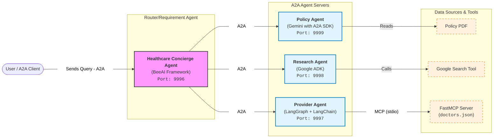

# Intro to A2A Protocol

1. Basic Question Answering Agent about Insurance Policies with No Agent Framework
2. [Insurance Policy Agent] Turn QA Agent into A2A Agent Server with A2A SDK (No Framework to show how the SDK works.)
3. Basic A2A Client with A2A SDK to show communication (No Framework to show how SDK works)
4. [Health Research Agent] ADK Agent using Gemini with Google Search tool to answer Health-based Questions. Using [ADK A2A exposing](https://google.github.io/adk-docs/a2a/quickstart-exposing/).
5. [Sequential Agent] ADK `SequentialAgent` connecting to Policy Agent and Health Agent in sequence. Using [ADK A2A consuming](https://google.github.io/adk-docs/a2a/quickstart-consuming/).
6. [Healthcare Provider Agent] A2A Agent calling an MCP Server, built with LangChain/LangGraph.
    - Uses [`langgraph-a2a-server`](https://github.com/5enxia/langgraph-a2a-server)
7. A2A Client with [Microsoft Agent Framework built-in Client](https://learn.microsoft.com/en-us/agent-framework/user-guide/agents/agent-types/a2a-agent?pivots=programming-language-python)
8. [Healthcare Concierge Agent] Full General Healthcare Agent built with [BeeAI Requirements Agent](https://framework.beeai.dev/experimental/requirement-agent) to call all of the A2A Agents in an Agentic way.
    - Using [BeeAI Built-in A2A Support](https://framework.beeai.dev/integrations/a2a)

## Architecture Diagram



## How to Run

Follow these steps to set up your environment and run the example agents. Each numbered module (`1. ...`, `2. ...`, etc.) is designed to be run in sequence.

### 1. Initial Setup

Before running the examples, complete the following setup steps:

1. **Create a [Gemini API Key](https://ai.google.dev/gemini-api/docs/api-key) or [configure your environment for Vertex AI](https://docs.cloud.google.com/vertex-ai/generative-ai/docs/start/quickstart?usertype=adc).**

2. **Configure Environment Variables:**
    - In the project root, make a copy of `example.env` and rename it to `.env`.

    ```sh
    cp example.env .env
    ```

    - Replace `"YOUR_GEMINI_API_KEY"` with your actual API Key.

3. **Install Dependencies:**
    - **Locally:** If you have `uv` installed, run:

      ```sh
      uv sync
      ```

    - **Notebooks / Google Colab:** If running in a notebook environment, you can install the dependencies by running the following in a cell:

      ```python
      %pip install .
      ```

## Running the Agents

You can run the agent servers using `uv run`. Ensure you are in the project root.

- **Policy Agent (Lesson 2):**

  ```sh
  uv run a2a_policy_agent.py
  ```

- **Research Agent (Lesson 4):**

  ```sh
  uv run a2a_research_agent.py
  ```

- **Provider Agent (Lesson 6):**

  ```sh
  uv run a2a_provider_agent.py
  ```

- **Healthcare Concierge Agent (Lesson 8):**

  ```sh
  uv run a2a_healthcare_agent.py
  ```
